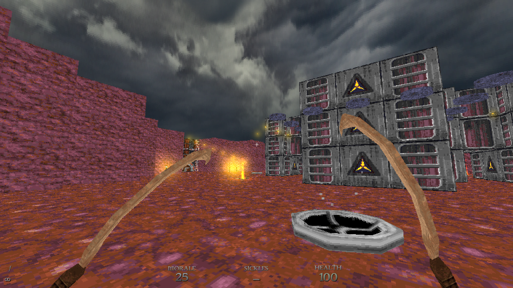
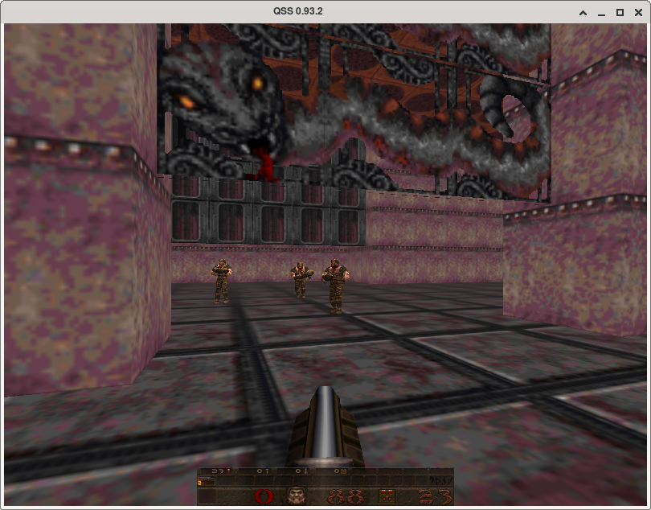

Converts [Rise of the Triad](https://www.gog.com/game/rise_of_the_triad__dark_war) maps and textures to Quake MAP and WAD files.

## Screenshots




## Building

### Ingredients

* Go 1.14+
* Make
* [quake101.wad file](https://www.wad-archive.com/wad/050ce481b07c283519e9e921e53db92a6a4d022b)

Copy quake101.wad to the r2q-data/ folder in the repository root.

### Building the CLI tool

```bash
make
```

## Invocation

```bash
./rott2quake -help
```

### Dumping textures to a folder and .wad file

This will dump out (most) textures in ROTT's .wad file to a destination folder as well as a .wad file usable in Quake:

```bash
./rott2quake -wad-out quake-rott.wad -dump DARKWAR.WAD <dest dir>
```

### Dumping maps to a folder

This will dump the following map data into a new folder: an HTML file containing the map grid, 3 files showing the wall/sprite/info plane values, and a .map file of the converted level that can be generated with TrenchBroom or ericw-tools.

NOTE: you need to generate a Quake .wad file from the invocation above and pass the path to it as `-wad-out`

```bash
./rott2quake -wad-out quake-rott.wad -rtl DARKWAR.RTL -rtl-map-outdir <dest dir>
```

or, with DARKWAR.RTL in the r2q-data/ folder:

```bash
make dump-maps
```

If you're generating maps to play in Dusk, scale the map to at least 1.5 its size:
```bash
./rott2quake -wad-out quake-rott.wad -rtl DARKWAR.RTL -rtl-map-scale 1.5 -rtl-map-outdir <dest dir>
```

or, with DARKWAR.RTL in the r2q-data/ folder:

```bash
make dump-maps-dusk
```

### Dumping Quake .pak files to a folder

```bash
./rott2quake -pak -dump pak0.pak <dest dir>
```

### Listing textures in a .wad file

ROTT:
```bash
./rott2quake -list DARKWAR.WAD
```

Quake:
```bash
./rott2quake -list -quake r2q-data/quake101.wad
```


## Supported items

- [X] World structure
- [X] Masked walls
- [X] Platforms
- [X] Trampolines
- [X] Weapon placement
- [X] Enemy placement
- [X] Doors
- [ ] Touchplate Triggers
  - [X] Pushwalls
  - [ ] Doors
- [X] Moving Walls
- [X] GADs
- [ ] Obstacles
  - [X] Flamethrowers
  - [X] Fireball shooters
  - [X] Rotating Blades
  - [ ] Crushers
  - [ ] Spikes


## Quirks / Known Issues / Fooken Raws

- Tops and bottoms of hswitch platforms are (intentionally) not rendered
- Map Scale cannot go past 3x without bad things happening. Quake won't
  render the floor or ceiling.
- Maps with more than 2 keys cannot be played in Quake. Maps with more
  than 3 keys cannot be played in Quake nor Dusk.


## Special Thanks

- The Quake Mapping Discord
- The New Blood Discord
